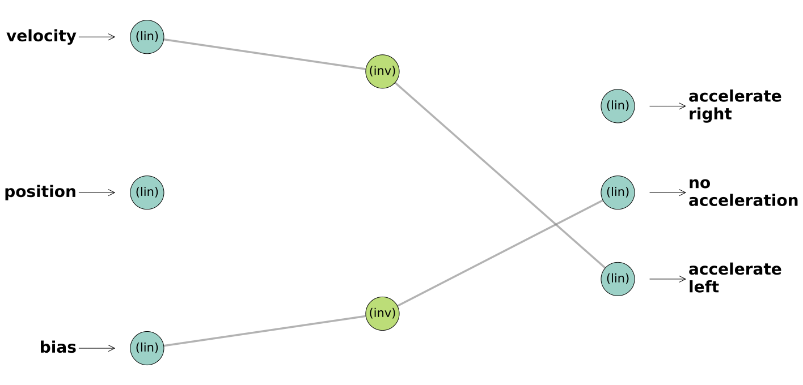
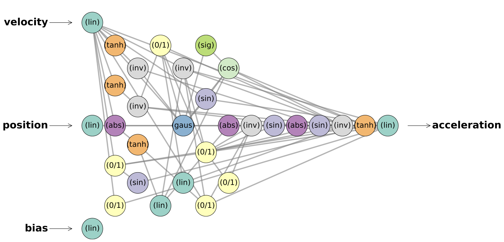
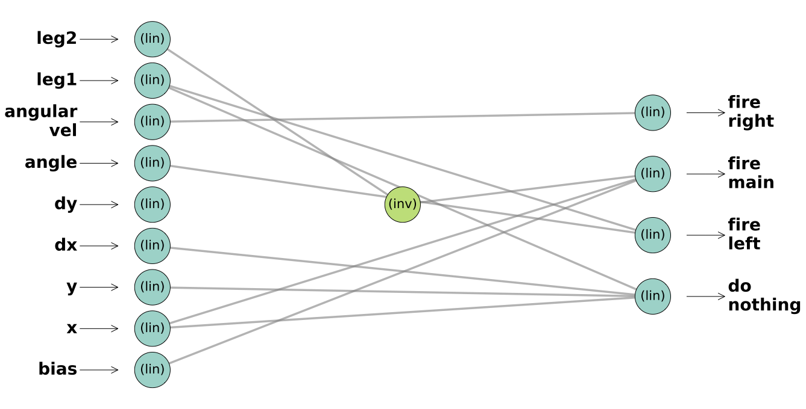
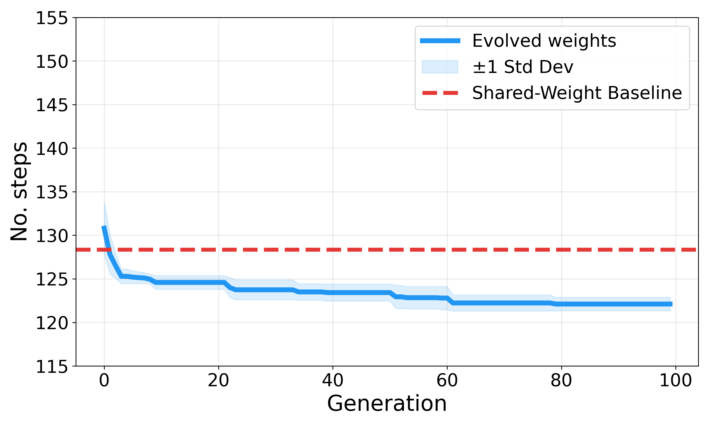
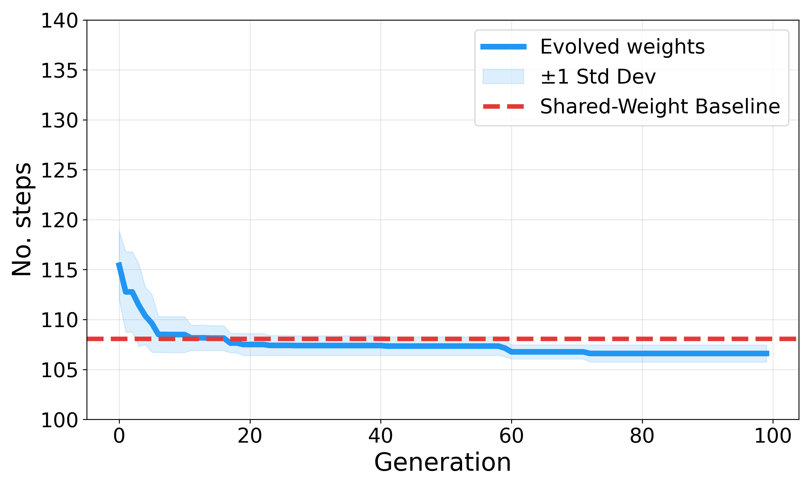
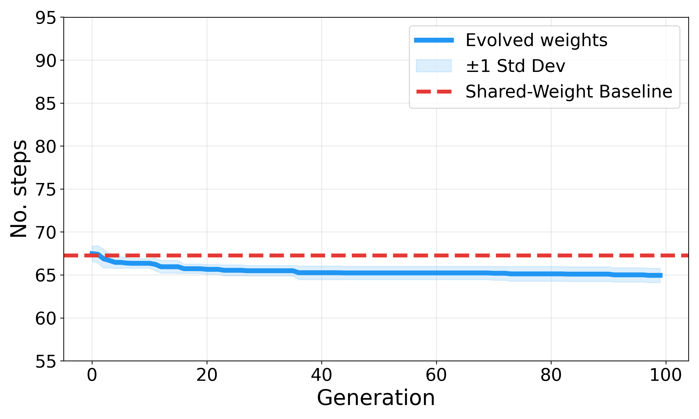

# Are Weight Agnostic Neural Networks Truly Weight Agnostic?

**An Empirical Analysis via Evolution Strategies**

> This project investigates whether the performance of Weight Agnostic Neural Networks (WANNs) in sparse reward environments can be improved through targeted weight optimization using OpenAI Evolution Strategies (ES). Our findings confirm that explicit weight tuning is unnecessary, the topology itself drives the solution.

📄 **[Read the Full Paper (PDF)]()**

---

## Table of Contents

- [Overview](#overview)
- [Contributions](#contributions)
- [Key Findings](#key-findings)
- [Environments](#environments)
- [Network Topologies](#network-topologies)
- [Results](#results)
- [Installation](#installation)
- [Usage](#usage)
  - [1. Train WANN Topologies](#1-train-wann-topologies)
  - [2. Train Individual Weights via ES](#2-train-individual-weights-via-es)
  - [3. Run Multiple Trials and Aggregate Data](#3-run-multiple-trials-and-aggregate-data)
  - [4. Plot Aggregated Data Manually](#4-plot-aggregated-data-manually)
  - [5. Visualize Network Topologies](#5-visualize-network-topologies)
- [Acknowledgements](#acknowledgements)
- [License](#license)

---

## Overview

[Weight Agnostic Neural Networks (WANNs)](https://arxiv.org/abs/1906.04358) discover network architectures that can solve tasks even when all connections share a single, uniform weight value. This makes them particularly effective in **sparse reward** environments, where traditional RL algorithms (PPO, DQN, Q-Learning) fail due to the lack of dense gradient information.

This project extends the work of [Lingenberg & Reuter (2025)](https://github.com/Tobi-Tob/Sparse-RL-Wann) by:

1. **Reconstructing** the optimal WANN topologies in **PyTorch** (with verified numerical equivalence to the original NumPy implementation).
2. **Applying OpenAI Evolution Strategies (ES)** to optimize individual connection weights of these fixed topologies.
3. **Demonstrating** that targeted weight optimization yields **no performance improvement** over the shared-weight baseline, confirming the weight-agnostic hypothesis.

---

## Contributions

The following scripts represent the main contributions of this project, built on top of the original [Sparse-RL-Wann](https://github.com/Tobi-Tob/Sparse-RL-Wann) codebase:

| Script | Description |
|:---|:---|
| `train_wann_weights.py` | ES weight optimization for WANN topologies. Runs the full training pipeline: shared-weight baseline evaluation, evolutionary weight optimization, statistical testing, and training curve generation. |
| `run_multiple_trials.py` | Executes multiple sequential training trials for a given environment across different random seeds, aggregates the resulting CSV data, and generates shaded statistical plots. |
| `plot_multiple_trials.py` | Parses CSV logs from multiple individual runs, calculates statistical metrics (mean and standard deviation), and creates shaded aggregated training curves to visualize performance variability. |
| `convert_wann.py` | PyTorch re-implementation of the WANN forward pass. Converts `.out` topology files into differentiable `nn.Module` objects, supporting both shared-weight and individual-weight modes. |
| `verify_consistency.py` | Numerical equivalence check between the original NumPy forward pass and the PyTorch re-implementation, ensuring identical outputs. |
| `print_networks.py` | Network topology visualization. Generates high-resolution PDF renderings of the evolved WANN architectures with labeled inputs, outputs, and activation functions. |

---

## Key Findings

| Configuration | SMC Discrete | SMC Continuous | Lunar Lander |
|:---|:---:|:---:|:---:|
| **Shared Baseline** | **129.3 ± 33.6** | **106.8 ± 13.4** | **67.0 ± 11.3** |
| ES Trained | 129.4 ± 32.8 | 106.9 ± 13.6 | 67.0 ± 12.1 |

> *Average steps ± std. dev. over 200 trials (lower is better).*

✅ **WANNs are genuinely weight agnostic**, topology alone encodes the control policy.\
✅ **Result holds across all complexity levels**, from 4 connections (SMC Discrete) to 71 connections (SMC Continuous).\
✅ **No reward shaping required**, compact, interpretable policies discovered via evolutionary search.

---

## Environments

All three environments use **sparse reward** formulations, where the agent receives non-zero feedback only upon successful task completion:

| Environment | State Dim | Action Space | Reward |
|:---|:---:|:---|:---|
| **Sparse Mountain Car (Discrete)** | 2 | 3 discrete actions (left, none, right) | R_t = 100 · 0.99^t on success, 0 otherwise |
| **Sparse Mountain Car (Continuous)** | 2 | 1 continuous value ∈ [-1, 1] | R_t = 100 · 0.99^t on success, 0 otherwise |
| **Lunar Lander** | 8 | 4 discrete actions (noop, left, main, right) | R_t = 100 · 0.999^t on safe landing, 0 otherwise |

---

## Network Topologies

The optimal WANN topologies discovered by [Lingenberg & Reuter](https://github.com/Tobi-Tob/Sparse-RL-Wann) and reconstructed in PyTorch. Nodes indicate the activation function used; edges represent connections whose weights are assigned a uniform shared value for baseline evaluation.

### Sparse Mountain Car - Discrete (2 hidden nodes, 4 connections)

<p align="center">
  
</p>

### Sparse Mountain Car - Continuous (31 nodes, 71 connections)

<p align="center">
  
</p>

### Lunar Lander (1 hidden node, 11 connections)

<p align="center">
  
</p>

---

## Results

The ES optimization across 100 generations fails to improve upon the shared-weight baseline for any environment. To examine the optimization dynamics, the multi-run aggregated training curves below illustrate the lowest step count achieved up to each generation, effectively displaying the historical best policy found during the search.

### Sparse Mountain Car - Discrete

<p align="center">
  
</p>

### Sparse Mountain Car - Continuous

<p align="center">
  
</p>

### Lunar Lander

<p align="center">
  
</p>

Although the cumulative training curves show that the optimized parameters occasionally reach a slightly lower step count than the shared-weight baseline, this marginal improvement does not generalize to the final evaluation stage. As reported in the Key Findings table, when evaluated over 200 independent episodes, the performance of the optimized weights aligns with the baseline. This minor discrepancy is due to the stochastic nature of the training environments and selection bias: specific weight configurations can exploit favorable episodes during the evolutionary search, but their advantage disappears under rigorous statistical verification.

> It is worth noting the extreme sparsity of the architectures solving the discrete tasks, e.g., comprising only 4 connections for the Sparse Mountain Car (Discrete). While one might intuitively attribute the lack of improvement to this heavily constrained parameter space, our results on the Sparse Mountain Car Continuous environment demonstrate otherwise. Despite possessing a significantly more complex architecture (71 connections), the targeted weight optimization still yielded no performance gains.
> 
> Ultimately, these findings provide compelling evidence that the discovered network structures are genuinely weight-agnostic. The fact that a targeted evolutionary optimization process fails to surpass the performance of a shared weight confirms that, regardless of the network's complexity, the problem-solving capability is inherently encoded within the topology itself, making explicit weight tuning unnecessary.

---

## Installation

**Prerequisites:** Python 3.8+ with `pip`.

```bash
# Clone the repository
git clone https://github.com/DanieleBordignon/Sparse-RL-WANN-PyTorch-ES.git
cd Sparse-RL-WANN-PyTorch-ES

# Install dependencies
pip install -r requirements.txt
```

---

## Usage

### 1. Train WANN Topologies

Run the evolutionary algorithm to discover new WANN architectures (from the [original codebase](https://github.com/Tobi-Tob/Sparse-RL-Wann)):

```bash
python wann_train.py
```

Pre-evolved champion networks for all three environments are already provided in `champions/`.

### 2. Train Individual Weights via ES

Run the OpenAI Evolution Strategies weight optimizer on a selected environment:

```bash
python train_wann_weights.py
```

Edit the `ENV_NAME` variable in `main()` to select the target environment:

```python
ENV_NAME = 'smc_discrete'    # Options: 'smc_discrete', 'smc_continuous', 'lunar_lander'
```

**Training configuration:**

| Parameter | Value | Description |
|:---|:---:|:---|
| `POP_SIZE` | 16 | Population size (×2 with antithetic sampling = 32 candidates) |
| `GENERATIONS` | 100 | Number of ES generations |
| `LEARNING_RATE` | 0.05 | Step size for weight updates |
| `SIGMA` | 0.05 | Noise standard deviation for perturbations |
| `N_EVALS_PER_CAND` | 100 | Episodes per candidate evaluation |

**Output:**
- Console log with per-generation statistics (population avg, policy eval, best overall)
- Training curve saved to `plots/<env_name>_training.pdf`
- Welch's t-test comparing baseline vs. trained weights (200-episode evaluation)

### 3. Run Multiple Trials and Aggregate Data

Execute multiple sequential training runs to assess variance and automatically generate shaded statistical plots:

```bash
python run_multiple_trials.py
```

*Note: Edit the `env_name` variable inside the script to change the target environment.*

### 4. Plot Aggregated Data Manually

If you already have the CSV logs from multiple runs and just want to regenerate the shaded plots:

```bash
python plot_multiple_trials.py --env smc_discrete
```

### 5. Visualize Network Topologies

Generate high-resolution PDF visualizations of all three WANN architectures:

```bash
python print_networks.py
```

---

## Acknowledgements

This project builds upon:

- **[Sparse-RL-Wann](https://github.com/Tobi-Tob/Sparse-RL-Wann)** by Lingenberg & Reuter, WANN topology evolution and sparse environment implementations.
- **[Weight Agnostic Neural Networks](https://arxiv.org/abs/1906.04358)** (Gaier & Ha, NeurIPS 2019), original WANN framework from [Google Brain Tokyo Workshop](https://github.com/google/brain-tokyo-workshop/tree/master/WANNRelease).
- **[Evolution Strategies as a Scalable Alternative to Reinforcement Learning](https://arxiv.org/abs/1703.03864)** (Salimans et al., 2017), OpenAI ES algorithm.

---

## License

This project is licensed under the **Apache License 2.0**, see [LICENSE](LICENSE) for details.